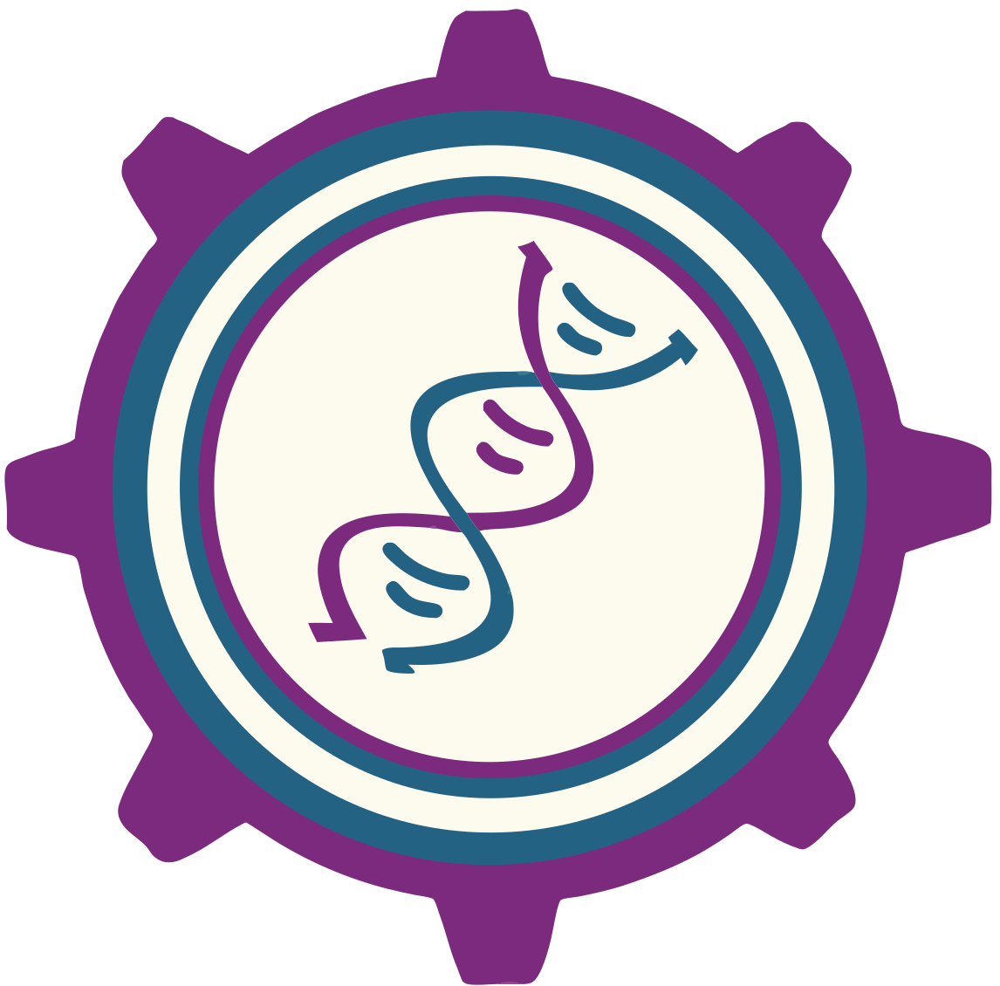

# UF EMBS Website

**The official website for the University of Florida Engineering in Medicine and Biology Society (EMBS) chapter**

---

## 🏛️ About IEEE EMBS

> **The IEEE Engineering in Medicine and Biology Society (EMBS)** is the world's largest international society of biomedical engineers. Our UF chapter promotes the application of engineering sciences and technology to medicine and biology.

### 🎯 Our Mission

- Foster innovation in biomedical engineering
- Connect students with industry professionals
- Promote research and development in medical technology
- Build a community of future biomedical engineers

### 🌟 Contributors

- **Gael Garcia (Webmaster)**
- **Lincy Phipps (Webmaster)**

## 🔗 Links

- [IEEE EMBS Official Website](https://www.embs.org/)
- [UF EMBS Chapter](https://www.ufembs.com/)

---

**Built with ❤️ by the UF EMBS Team**

